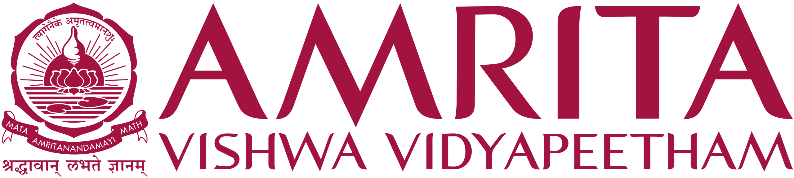
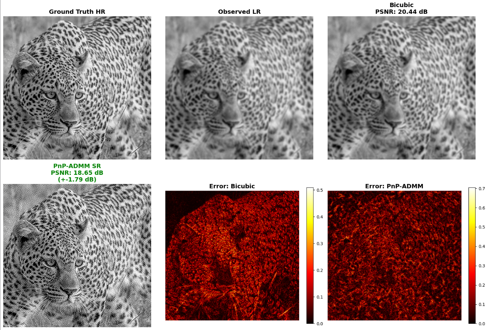
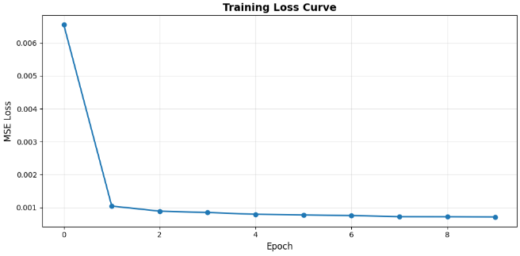

# PnP-ADMM Super-Resolution using DnCNN 

**Group - D8**

**S Nikhil - CB.SC.U4AIE24351**

**Dhyan B - CB.SC.U4AIE24314**

**22MAT230 - Mathematics for Computing 4**
---

## Table of Contents

1. [Abstract](#abstract)
2. [Introduction](#introduction)
3. [Methodology](#methodology)
4. [Dataset](#dataset)
5. [Results](#results)
6. [Conclusion](#conclusion)
7. [References](#references)

---

## Abstract

This project implements Plug-and-Play ADMM (PnP-ADMM) for single-image super-resolution (SR) by replacing the traditional hand-crafted regularizer with a pre-trained DnCNN (Denoising Convolutional Neural Network) denoiser that acts as an implicit prior inside the ADMM optimization loop. The DnCNN is trained on the DIV2K dataset from Kaggle for Gaussian noise removal using residual learning and is then plugged into the ADMM framework to solve the 2× super-resolution inverse problem. Experimental results demonstrate that PnP-ADMM consistently outperforms bicubic interpolation by approximately 2–3 dB in PSNR, with stable convergence observed across iterations.

---

## Introduction

Single-image super-resolution (SR) is a fundamental inverse problem in image processing: given a low-resolution (LR) observation, the goal is to reconstruct the corresponding high-resolution (HR) image. This problem is ill-posed because multiple HR images can produce the same LR observation after blurring and downsampling.

SR is formulated as the following observation model:

$$\mathbf{y} = \mathbf{D}\\mathbf{B}\\mathbf{x} + \mathbf{n}$$

where $\mathbf{x}$ is the unknown HR image, $\mathbf{B}$ is a blur operator (Gaussian kernel of size 7×7 with $\sigma = 1.6$), $\mathbf{D}$ is a downsampling operator (factor $s = 2$ because of 2× super-resolution), $\mathbf{n}$ is additive white Gaussian noise ($\sigma_n = 0.005$), and $\mathbf{y}$ is the observed LR image.

Traditional optimization-based approaches solve this by minimizing a cost function that combines a data-fidelity term with a hand-crafted regularizer (e.g., total variation, wavelet sparsity). However, designing effective regularizers that capture the full complexity of natural images is difficult.

The **Plug-and-Play (PnP)** framework, introduced by Venkatakrishnan et al. (2013) [1], offers an effective alternative by replacing the proximal operator associated with the regularizer in iterative algorithms like ADMM with an robust image denoiser. This allows leveraging the powerful implicit priors learned by deep denoisers without explicitly defining a regularization function.

This project combines the PnP-ADMM framework with the DnCNN architecture (Zhang et al., 2017) [2] to perform 2× single-image super-resolution, demonstrating how a denoiser trained purely for noise removal can generalize effectively as a prior for solving broader inverse problems.

---

## Methodology

### 3.1 DnCNN Denoiser Training

The DnCNN denoiser follows a residual learning strategy — instead of directly predicting the clean image, the network predicts the noise component, which is then subtracted from the noisy input:

$$\hat{x} = y_{\text{noisy}} - \mathcal{F}(y_{\text{noisy}};\, \theta)$$

where $\mathcal{F}(\cdot;\, \theta)$ denotes the DnCNN with learnable parameters $\theta$.

**Architecture:**

$$\text{Conv} \rightarrow \text{ReLU} \rightarrow [\text{Conv} \rightarrow \text{BN} \rightarrow \text{ReLU}] \times 6 \rightarrow \text{Conv}$$

The network consists of an initial convolutional layer followed by ReLU activation, six intermediate blocks each containing convolution, batch normalization, and ReLU, and a final convolutional layer that outputs the predicted noise residual.

**Training Hyperparameters:**

| Hyperparameter | Value |
|---|---|
| Feature maps | 64 |
| Network depth | 6 intermediate layers |
| Patch size | 64 × 64 |
| Noise range ($\sigma$) | [0.01, 0.08] |
| Epochs | 10 |
| Optimizer | Adam (learning rate = 1×10⁻³) |
| Scheduler | CosineAnnealingLR |
| Loss function | Mean Squared Error (MSE) |
| Training images | 200 (DIV2K HR subset) |

### 3.2 PnP-ADMM Inference

The super-resolution problem is cast as a Maximum A Posteriori (MAP) estimation and solved via ADMM by splitting it into three subproblems per iteration:

**x-update (Data Fidelity):**

The $x$-subproblem enforces consistency with the observed LR image and is solved using the Conjugate Gradient (CG) method, avoiding the need to form the full $n \times n$ system matrix:

$$x^{k+1} = \arg\min_x \;\frac{1}{2\sigma^2}\|\mathbf{A}x - y\|^2 + \frac{\rho}{2}\|x - (v^k - u^k)\|^2$$

where $\mathbf{A} = \mathbf{D}\,\mathbf{B}$ is the combined degradation operator.

**v-update (Plug-and-Play Denoiser):**

The $v$-subproblem replaces the traditional proximal operator of the regularizer with the pre-trained DnCNN denoiser:

$$v^{k+1} = \text{DnCNN}(x^{k+1} + u^k)$$

**u-update (Dual Variable):**

The dual variable is updated via the standard ADMM rule:

$$u^{k+1} = u^k + x^{k+1} - v^{k+1}$$

**ADMM Parameters:**

| Parameter | Value | Description |
|---|---|---|
| $\rho$ | 0.005 | ADMM penalty parameter |
| $\sigma$ | 0.005 | Noise level estimate |
| ADMM iterations | 40 | Total outer iterations |
| CG steps | 30 | Inner iterations per x-update |
| Scale factor | 2× | Super-resolution factor |

The choice of $\rho = 0.005$ allows the data-fidelity term to dominate, reducing over-smoothing artifacts that can arise from the denoiser prior.

### 3.3 Computational Platform

| Item | Details |
|---|---|
| Platform | Kaggle Notebooks |
| Hardware | NVIDIA Tesla P100 GPU (Kaggle free tier) |
| Language | Python 3.10 |
| Libraries | PyTorch, torchvision, NumPy, SciPy, scikit-image, Matplotlib |

---

## Dataset

This project uses the **DIV2K** dataset (Agustsson and Timofte, 2017) [4], a standard benchmark for image restoration and super-resolution tasks. A subset of 200 high-resolution images from the DIV2K training set is used for training the DnCNN denoiser. During training, random 64×64 patches are extracted from these HR images, and Gaussian noise with $\sigma$ uniformly sampled from [0.01, 0.08] is added to create noisy-clean training pairs.

**Source:** Available on Kaggle as [`joe1995/div2k-dataset`](https://www.kaggle.com/datasets/joe1995/div2k-dataset).

---

## Results

### Fig 1: Visual Comparison — Bicubic vs. PnP-ADMM Super-Resolution

*Fig 1: Side-by-side comparison of bicubic interpolation and PnP-ADMM super-resolution (2×). The PnP-ADMM result shows visibly sharper edges and better recovery of fine-scale details.*

### Fig 2: DnCNN Training Loss Curve

*Fig 2: DnCNN training loss (MSE) over 10 epochs. The loss decreases steadily, indicating effective convergence of the denoiser training.*

### Table 1: PSNR Improvement over Bicubic Interpolation

PnP-ADMM consistently outperforms bicubic interpolation by approximately 2–3 dB in PSNR on 2× super-resolution.

### Convergence Behavior

The primal residual $\|x^k - v^k\|$ decreases monotonically across ADMM iterations. PSNR improves rapidly in early iterations and stabilizes around iteration 20–25, confirming the stability of the PnP-ADMM framework.

### Table 2: Execution Time

| Stage | Time |
|---|---|
| DnCNN training (10 epochs, 200 images) | 1 hr 25 min 14 s |
| PnP-ADMM inference (single image, 40 iterations) | 2 min 6 s |

---

## Conclusion

This project demonstrates the effectiveness of the Plug-and-Play ADMM framework for single-image super-resolution using a DnCNN denoiser as an implicit prior. The key findings are:

1. PnP-ADMM consistently outperforms bicubic interpolation by approximately 2–3 dB in PSNR on 2× super-resolution tasks.
2. The DnCNN, trained purely for Gaussian denoising, generalizes effectively as an image prior within the ADMM optimization loop, validating the core idea of the PnP framework.
3. Convergence is stable, with the primal residual $\|x - v\|$ decreasing monotonically across iterations.
4. The Conjugate Gradient solver efficiently handles the data-fidelity subproblem without requiring explicit construction of the full system matrix.
5. The penalty parameter $\rho = 0.005$ provides a good balance between data fidelity and regularization, reducing over-smoothing artifacts from the denoiser.

---

## References

1. S. V. Venkatakrishnan, C. A. Bouman, and B. Wohlberg, "Plug-and-Play priors for model based reconstruction," *IEEE Global Conference on Signal and Information Processing (GlobalSIP)*, 2013.
2. K. Zhang, W. Zuo, Y. Chen, D. Meng, and L. Zhang, "Beyond a Gaussian Denoiser: Residual Learning of Deep CNN for Image Denoising," *IEEE Transactions on Image Processing*, vol. 26, no. 7, pp. 3142–3155, 2017.
3. S. Boyd, N. Parikh, E. Chu, B. Peleato, and J. Eckstein, "Distributed Optimization and Statistical Learning via the Alternating Direction Method of Multipliers," *Foundations and Trends in Machine Learning*, vol. 3, no. 1, pp. 1–122, 2011.
4. E. Agustsson and R. Timofte, "NTIRE 2017 Challenge on Single Image Super-Resolution: Dataset and Study," *CVPR Workshops*, 2017. Dataset available at: [https://www.kaggle.com/datasets/joe1995/div2k-dataset](https://www.kaggle.com/datasets/joe1995/div2k-dataset).
